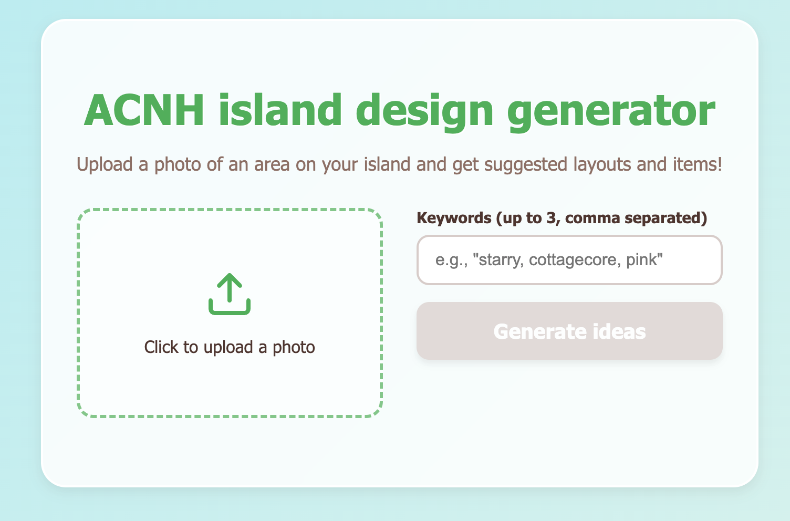

This is a web app that generates design ideas for Animal Crossing New Horizons islands.



This project is a Next.js project bootstrapped with [`create-next-app`](https://nextjs.org/docs/app/api-reference/cli/create-next-app).

## Getting Started

To use this app:

1. Run the development server:

```bash
npm run dev
```

1. Open [http://localhost:3000](http://localhost:3000) with your browser to see the result.
   
1. On the webapp, enter 1-3 design keywords (e.g., "fairycore", "pink") and upload an image of an area of your island.

1. Click **Generate ideas**.
